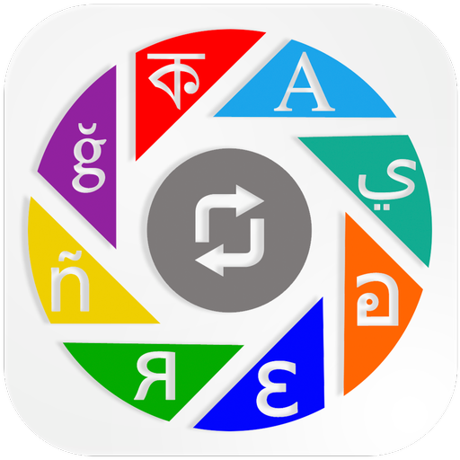
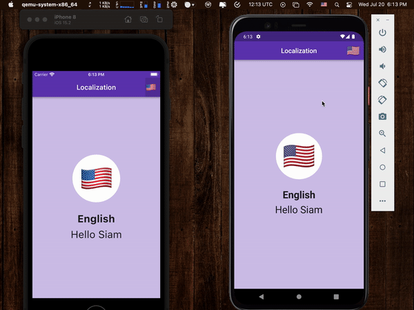
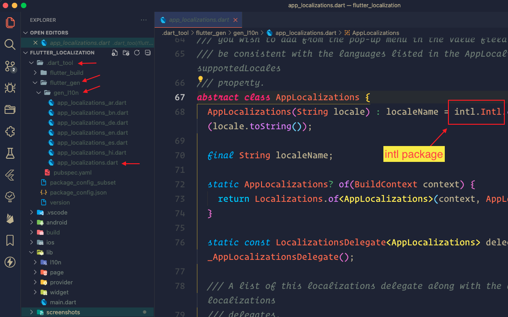

&nbsp;&nbsp;
&nbsp;&nbsp;
<a href="https://choosealicense.com/licenses/mit/" target="_blank"></a>&nbsp;&nbsp;
&nbsp;&nbsp;


# Flutter Localization

</img>

This repo is for enabling localization in a flutter application. I am using an [YouTube](https://www.youtube.com/watch?v=Zw4KoorVxgg&t=20s) tutorial video for developing this application.

The official documentation for flutter localization can be found [here](https://docs.flutter.dev/development/accessibility-and-localization/internationalization)

For language code visit: https://www.science.co.il/language/Codes.php

## App Demo

<p align="center"></p>

## File Pattern Inside The `lib` Folder

```
lib/
├── l10n/
│   ├── app_ar.arb
│   ├── app_bn.arb
│   ├── app_de.arb
│   ├── app_en.arb
│   ├── app_es.arb
│   ├── app_he.arb
│   ├── app_hi.arb
│   └── l10n.dart
├── page/
│   └── home_page.dart
├── provider/
│   └── locale_provider.dart
├── widget/
│   ├── language_picker_widget.dart
│   └── language_widget.dart
└── main.dart
```

## Location of Auto-Generated `localization` Files

<p align="center"></p>
